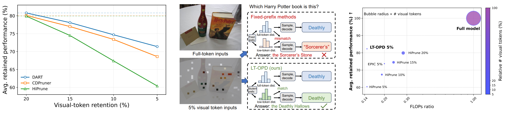
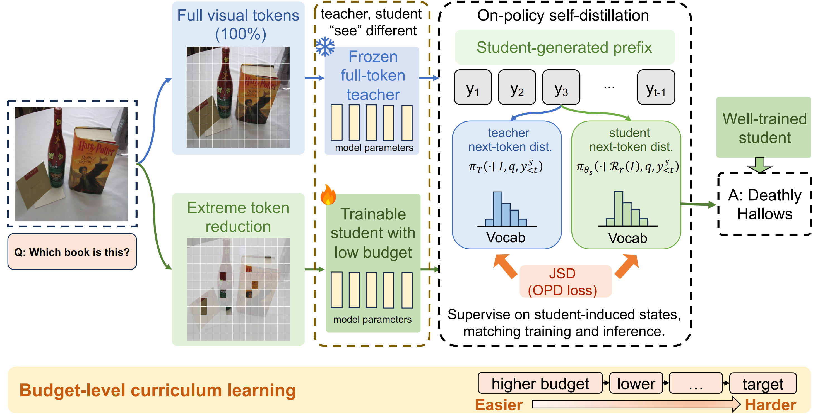
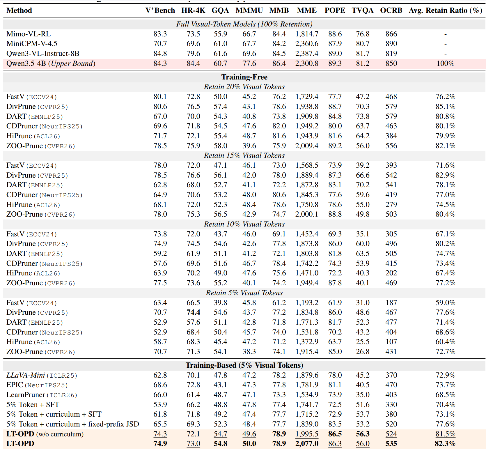
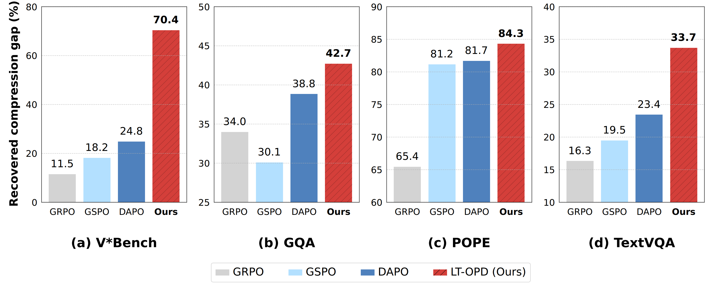
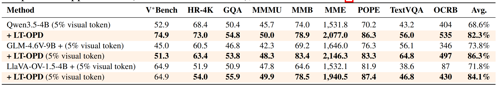

# Fewer Tokens, More Self-Teaching: On-Policy Self-Distillation for Extreme Visual Token Reduction    
[Junxian Li](https://lijunxian111.github.io), [Ruixuan Yang](https://openreview.net/profile?id=~Ruixuan_Yang2), [Tianao Zhang](https://scholar.google.com/citations?user=Cb34iaEAAAAJ&hl=en&oi=ao), [Tiange Xu](http://openreview.net/profile?id=~Tiange_Xu1), [Weisheng Dong](https://scholar.google.com/citations?user=-g58LsoAAAAJ&hl=en&oi=ao), and [Yulun Zhang](https://yulunzhang.com)  

"Fewer Tokens, More Self-Teaching: On-Policy Self-Distillation for Extreme Visual Token Reduction", arXiv 2026  

<div>
  <a href="https://github.com/Yrxxxxxxxx1007/LT-OPD/releases" target='_blank' style="text-decoration: none;"></a>
<a href="https://huggingface.co/datasets/yyy051007/LT-OPD-14K" target="_blank">
  </a>
<a href="https://github.com/Yrxxxxxxxx1007/LT-OPD" target='_blank' style="text-decoration: none;"></a>
<a href="https://arxiv.org/abs/2609.32353">
    
  </a>
<a href="https://github.com/Yrxxxxxxxx1007/LT-OPD/stargazers" target='_blank' style="text-decoration: none;"></a>
</div>  

[Project](https://github.com/Yrxxxxxxxx1007/LT-OPD) · [Training data](https://huggingface.co/datasets/yyy051007/LT-OPD-14K) · [Evaluation](src/evaluation/README.md) · [Checkpoints](src/learnable_merge)  


#### 🔥🔥🔥 News

- **2026-09-25:** The trained checkpoints of [newest verstion](src/learnable_merge) of LT-OPD is released. The scores are higher, 82.3->84.5% of the full-token model!  
- **2026-09-25:** This repo (code and data) is released.

---

> **Abstract:** Visual token reduction is an effective way to accelerate multimodal large language models (MLLMs), but performance deteriorates rapidly under extremely low token budgets. Existing work has explored both visual-token selection and training-based adaptation to reduced visual inputs. We take a step further by asking how a heavily compressed MLLM should learn from the states induced by its own generations. This setting naturally calls for on-policy self-distillation: a heavily compressed model is supervised on the states induced by its own generations, while its full-token counterpart serves as an information-rich teacher. 

> Based on this insight, we propose LT-OPD, a training framework for extreme visual-token reduction. The student rolls out responses with only a small fraction of visual tokens, and a frozen full-token copy of the same MLLM provides distributional supervision along these student-generated trajectories. To stabilize on-policy learning when visual evidence is severely limited, we further introduce a budget-level curriculum that progressively decreases the token budget during training. Across nine benchmarks on Qwen3.5-4B, LT-OPD raises average retained performance under 5% visual-token retention from 68.6% to 82.3%, outperforming training-free, training-based, and reinforcement-learning baselines at the same budget. The gains transfer consistently to Qwen3.5-9B, GLM-4.6V-9B, and LLaVA-OV-1.5-4B. LT-OPD also reduces KV-cache usage by 85.2% and prefill FLOPs by 85.4% without additional inference overhead, demonstrating that on-policy learning can substantially recover capabilities lost to extreme visual-token reduction.



---  

### Pipeline



---


## Code layout

```text
src/
├── learnable_merge # The latest and best version of our LT-OPD: adding a tiny learnable merging module after CDPruner  
├── training/      # Training configuration, launcher, and checkpoint export
├── verl/          # Training core, JSD, Qwen3.5 integration, and CDPruner
├── data/          # LT-OPD-14K preparation
└── evaluation/    # Benchmark inference and scoring
```
If you want to use the codes, please:  
```bash
cd src
```  


## Setup

Use Python 3.12 and a CUDA environment. Install the package and its training dependencies:

```bash
pip install torch==2.10.0 torchvision==0.25.0 --index-url https://download.pytorch.org/whl/cu126
pip install -e '.[train,eval]'
pip install flash-attn==2.8.3 --no-build-isolation
```

## Data

LT-OPD-14K contains 14,000 examples from OneThinker, PixMo, LLaVA, TextVQA, and Vision-OPD. The Hugging Face release keeps the training order and ships every image in content-addressed tar shards, with per-sample provenance and SHA-256 recorded in `media.jsonl`.

```bash
python -m data.prepare --dataset yyy051007/LT-OPD-14K --output data/LT-OPD-14K
```

Preparation verifies the release checksums and all 14,000 images before writing the training files. Pass `--source-media` to reuse an image directory you already have.

## Training

Download the base model, then launch training:

```bash
hf download Qwen/Qwen3.5-4B \
  --revision 851bf6e806efd8d0a36b00ddf55e13ccb7b8cd0a \
  --local-dir models/Qwen3.5-4B

python -m training.train \
  --model models/Qwen3.5-4B \
  --data-dir data/LT-OPD-14K \
  --output outputs/lt-opd
```

The default configuration uses eight GPUs and full-parameter training, including the visual encoder and merger.

| Setting | Value |
| --- | --- |
| Training updates | 175 |
| Batch | 80 questions × 8 student rollouts |
| Teacher | Frozen Qwen3.5-4B with all visual tokens |
| Objective | Token-level JSD |
| Visual-token curriculum | 25% for 14 updates, cosine decay, 5% for the final 75 updates |

Set `--gpus` and `--nodes` for your hardware. Use `--resume` to continue a saved run.

## Evaluation

Export the trained checkpoint:

```bash
python -m training.export \
  --checkpoint /path/to/saved_checkpoint \
  --base-model models/Qwen3.5-4B \
  --output outputs/lt-opd/export
```

The evaluation suite covers **V*Bench, HRBench-4K, GQA, MMMU, MMBench, MME, POPE, TextVQA, and OCRBench**. Inference and scoring are separate commands; dataset preparation, protocol details, and scorer versions are listed in the [evaluation guide](src/evaluation/README.md).


## <a name="results"></a>🔎 Results

We present the performance of LT-OPD compared with previous SOTA methods.

<details open>
<summary>Main Results (click to expand)</summary>

- Results in Tab.2 of the main paper

<p align="center">
  
</p>

- Results in Fig. 4 of the main paper (compared with RL algorithms)

<p align="center">
  
</p>
</details>

<details open>
<summary>Compared with RL algorithms</summary>

- Results in Tab.4 of the main paper (cross-model performance)

<p align="center">
  
</p>
</details>


## <a name="citation"></a>📎 Citation

If you find our dataset and code helpful in your research or work, please cite the following paper.

```ruby
@article{li2026fewer,
      title={Fewer Tokens, More Self-Teaching: On-Policy Self-Distillation for Extreme Visual Token Reduction}, 
      author={Li Junxian and Yang Ruixuan and Zhang Tianao and Xu Tiange and Dong Weisheng and Zhang Yulun},
      journal={arXiv preprint arXiv:2609.32353},
      year={2026}
}
```

## Acknowledgements

Built on [verl](https://github.com/volcengine/verl), [SDPO](https://github.com/lasgroup/SDPO), and [CDPruner](https://github.com/Theia-4869/CDPruner). Benchmark scorers retain their upstream attribution and versions.
